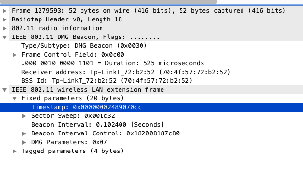

# Modifications to AD7200 drivers & firmware

This fork of [seemoo-lab/lede-ad7200](https://github.com/seemoo-lab/lede-ad7200) includes modifications to the `wil6210` driver, namely:

1. Addition of DMG `wlan.fixed.timestamp` timestamps to sweep dumps
2. Sending sweep dumps via UDP in binary format, directly from the kernel space

This README explains modification 1. Modification 2 ended up being a pointless exercise, so I'll leave an explanation for later. It can still be interesting if you want to learn how to modify the `wil6210` driver.

These modifications should be used together with changes to the `wil6210` firmware, available [here](https://github.com/adamiaonr/nexmon-arc).

## Goal

Say you want to validate the sector choice made by the Talon AD7200 during a particular sector sweep.
Assume that we want to validate the choice of Tx sector of the AP, given the feedback from the client. 

We would need two things:

1. A list of the SNR values, one per Tx sector of the AP, measured on the client
2. The AP Tx sector chosen by the client

With the tools we have at our disposal, we can easily get each piece of information as follows: 

1. Generate sweep dumps, making use of modified `wil6210` firmware [[1]](https://github.com/seemoo-lab/nexmon-arc) and the `debugfs` facility provided in [[2]](https://github.com/seemoo-lab/lede-ad7200). This can be automated with [a script such as this one](https://github.com/adamiaonr/wifi-vehicles/blob/802.11ad/testbed-setup/configs/openwrt/tp-04/root/workbench/get-sweep-dump.sh).
2. Looking at the `wlan.sswf.sector_select` field in SLS Feedback Frames (`wlan.fc.type_subtype` 362) in .pcap files using **an additional AD7200 router** in monitor mode, produced by `tcpdump`. Again, this can also be automated with [a script](https://github.com/adamiaonr/wifi-vehicles/blob/802.11ad/testbed-setup/configs/openwrt/tp-03/usr/bin/run-monitor).

## Problem

Since each piece of info is captured in two different machines - let's call them **M1** and **M2** - we must link a set of SNR values in a sweep dump file to a particular SLS Feedback frame in the .pcap file.
This is a particularly difficult task, because SLS frames do not have sequence numbers that can be used as a merging key.

In addition, using system-level timestamps taken independently at M1 and M2 doesn't work because:

1. The clocks in M1 and M2 won't be synchronized
2. With the tools we have at our disposal for capturing sweep dumps, we cannot assign an individual timestamp to each SLS, much less to each individual SLS frame. Using the `debugfs` modifications given in [[2]](https://github.com/seemoo-lab/lede-ad7200), SLSes are gathered from the `wil6210` in batches of hundreds of SLS frames.
3. SLSes can happen very frequently - as fast as 1 every msec - with each SLS consisting in the exchange of 72 SLS frames. Following from reason 2, a sweep dump can then assign the same timestamp to hundreds of SLS frames. 
4. Either side - i.e., M1 and M2 - is not guaranteed to capture all the SLSes that occur in a given period of time. M1 may miss some SLSes that M2 hears, and vice-versa.

## Solution (?)

Ideally, we'd like to come up with a merging key such that:

* It appears in the files produced by both M1 and M2
* The order of appearance of SLSes and keys is the same in the timelines of both files, regardless of the offset of the clocks between the two machines
* Keys and SLSes should be perfectly interleaved, so that to allow 100% matching between sweep dumps and SLS feedback frames. E.g., something like this : 

| time @M1 | event |   | time @M2 | event |
|------|-------|---|------|-------|
| ... | ... |   | t1' | key 1 |
| t1 | key 1   |   | t2' | SLS 1 FB |
| t2 | SLS 1 list | | t3' | key 2 |
| t3 | key 2 | | t4' | SLS 2 FB |
| t4 | SLS 2 list | | t5' | key 3 |
| t5 | key 3 | | ... | ... |
| ... | ... | | ... | ... |

### DMG timestamps

DMG beacons (`wlan.fc.type_subtype` 0x0030) carry a 8 byte microsecond resolution timestamp field:



This timestamp represents the TSF timer of the AP, and is sent out in DMG beacons periodically for time synchronization purposes [[3]](https://eprints.networks.imdea.org/2019/1/Hany%20Assasa%27s%20PhD%20Thesis.pdf).

The DMG timestamp can be a good merging key because:

* DMG beacons - and thus DMG timestamps - are visible to both M1 and M2
* DMG timestamps are supposed to increase monotonically every microsecond (except when it wraps around)

However, there is still a drawback: in the example above, the periodicity is set to 102.4 msecs. 
This resolution is quite coarse, given that the interval between SLSes can be as low as 1 msec.
However, it can still be useful to validate some of the SLSes.

## Usage instructions

1. Build and flash an AD7200 router with a DMG-capable LEDE image. Using the [dmg-timestamp branch](https://github.com/adamiaonr/lede-ad7200/tree/dmg-timestamp), follow the same procedure as described in [[1]](https://github.com/seemoo-lab/lede-ad7200).

2. Use [this nexmon-arc branch](https://github.com/adamiaonr/nexmon-arc) to compile a DMG-capable version of the `wi6210.fw` firmware, and copy it to the router's `/lib/firmware` folder.
This will allow the AD7200 router to capture DMG timestamps and include the last seen DMG timestamp on sweep dump records.

3. Power-cycle the router to make the firmware change effective and re-login.

4. Running `cat /sys/kernel/debug/ieee80211/phy2/wil6210/sweep_dump` should now show an extra column with the title `tmstmp`, similar to the following:

```
Counter: 1661 swps, 16144 pkts
Sector Sweep Dump: {
 [ctr: 1635 src: 70:4f:57:72:b2:52 sec:   1 cdown:  34 dir: 1 snr:  17.25 dB (0x0114) tmstmp: 2406195860]
 [ctr: 1635 src: 70:4f:57:72:b2:52 sec:   2 cdown:  33 dir: 1 snr:  15.94 dB (0x00ff) tmstmp: 2406195860]
 [ctr: 1635 src: 70:4f:57:72:b2:52 sec:   3 cdown:  32 dir: 1 snr:  15.81 dB (0x00fd) tmstmp: 2406195860]
 [ctr: 1635 src: 70:4f:57:72:b2:52 sec:   4 cdown:  31 dir: 1 snr:  15.38 dB (0x00f6) tmstmp: 2406195860]
 [ctr: 1635 src: 70:4f:57:72:b2:52 sec:   5 cdown:  30 dir: 1 snr:  19.00 dB (0x0130) tmstmp: 2406195860]
 (...)
```

**(Optional)** If you'd like to try out further changes to the wil6210 driver after the initial compilation, you can directly modify the `debugfs.c` and/or `sweep_info.h` source files, re-compile the kernel module and then re-install it as a `.ipk` file via `opkg`. 
Follow these steps:

1. Modify the source files as required. The files are in the directory build\_dir/target-arm\_cortex-a15+neon-vfpv4\_musl-1.1.16\_eabi/linux-ipq806x/compat-wireless-2017-01-31/drivers/net/wireless/ath/wil6210
	
2. Run `make V=1` to compile your changes
	
3. Copy the file bin/targets/ipq806x/generic/packages/kmod-wil6210\_4.4.167+2017-01-31-14\_arm\_cortex-a15\_neon-vfpv4.ipk to the router's `/tmp` folder.

4. In the router install the kernel module by running `opkg install --force-reinstall /tmp/kmod-wil6210_4.4.167\+2017-01-31-14_arm_cortex-a15_neon-vfpv4.ipk`.
